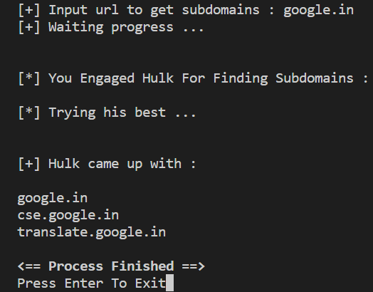
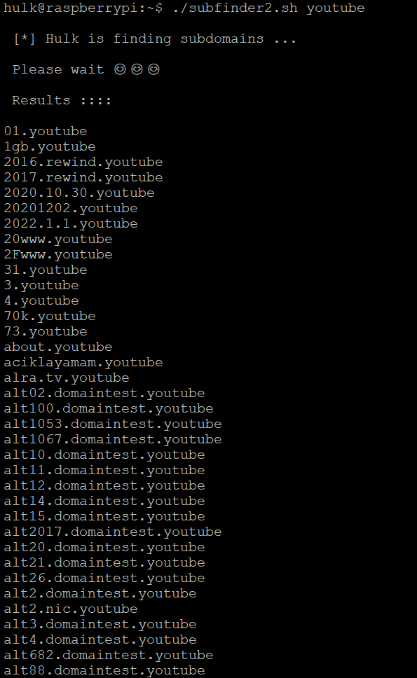

# Subdomain Finder
##
## This tool can be used for going through all domains' subdomains
##
## It can support all the platforms 
##
## If it contains any damages just go for others
##
## scripting on bash can only run in linux or unix enviroment
#
##
__Author__ : R3DHULK
#
##
## Subdomain-finder.py output :

##
## Subdomain-finder.sh output :

## Installation :
##
git clone https://github.com/R3DHULK/find-subdomains
##
cd find-subdomains
## 
pip install -r requirements.txt
## 
chmod +x subdomain-finder.sh (for linux/termux user)
## 
./subdomain-finder.sh <url>
## 
python subdomain-finder.py ( It will ask you the url name)

##
🔴 Use It For Educational Purpose. It's not my duty to look after you 😒